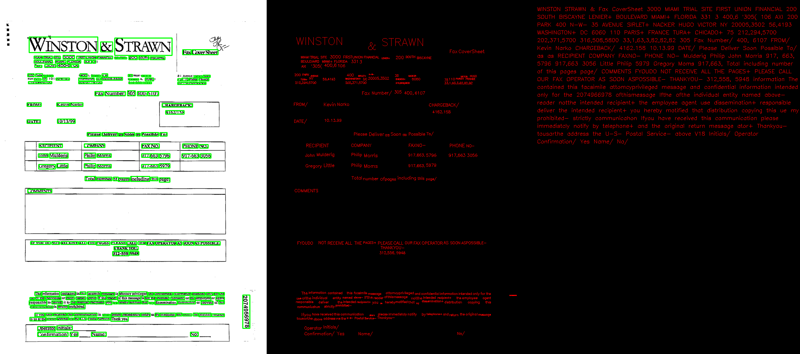

# Tuatara: Deep Learning OCR Engine

Tuatara is a deep learning based OCR engine built on [CRAFT](https://github.com/clovaai/CRAFT-pytorch) for text detection, and [PARSEQ](https://github.com/baudm/parseq) for text recognition. This project is mainly a way for me to explore and experiment with vision and NPL model performance.

This code is currently a work in progress and is not intended for production use.

The project is named after the [tuatara](https://en.wikipedia.org/wiki/Tuatara), a lizard-like ([rhynchocephalia](https://en.wikipedia.org/wiki/Rhynchocephalia)) reptile native to New Zealand. Like it's lizard cousin's the tuatara has a parietal eye/third eye, symbolic of prescient abilities.

## Example


## Design Goals
1. Easy to understand and hackable - All the main code is in tuatara.cpp and is currently about 500 LOC
2. Preference for targeting CPU over GPU and focus on CPU performance
3. Minimal dependencies and small binary - The plan is to replace both the two main dependencies OpenCV and LibTorch with [Eigen](https://eigen.tuxfamily.org/index.php?title=Main_Page). I believe this will support goals 1 and 2.

## Setup with docker

### docker container with VSCode
To build and run through visual studio code, make sure the remote development extension is installed.<br>

The repository provides a .devcontainer.json which should allow you to directly reopen the cloned folder in a docker container using the bottom left icon and select `Reopen in container`as illustrated below


For information, building the whole container may take some time since a `Dockerfile` step builds OpenCV from source. On a basic developer machine it tooks an hour and half.<br>

When the container is finally built, you can open a terminal and your working folder should be `/workspace/ocr-c++` as mentionned `.devcontainer.json` the field `"workspaceFolder": "/workspaces/ocr-c++"`. You should have the three folders:
- `models` containing the automatically downloaded PyTorch detection and recognition models,
- `thirdparty` containing the automatically downloaded libtorch library
- `tuatara` containing the code

You can proceed as usual to build the cmake project
```
mkdir -p /workspaces/ocr-c++/tuatara/build
cd /workspaces/ocr-c++/tuatara/build
cmake ..
make
```
The binaries should be available in `build` folder, to run the example application just run:
```
cd /workspaces/ocr-c++/tuatara/build
examples/table /workspaces/ocr-c++/tuatara/images/resume_example.png
```
To run the python binding example
```
cd /workspaces/ocr-c++/tuatara/bindings
python3.11 run_ocr.py
```
### docker container with command line
Considering that the repository was cloned in the folder `/my/working/directory/tuatara` for illustration.
#### Build the docker container
Build a docker image named for example `ocr_engine` from the `Dockerfile` inside the `/my/working/directory/tuatara` directory.<br>
For information, building the whole container may take some time since a `Dockerfile` step builds OpenCV from source. On a basic developer machine it tooks an hour and half. 
```
docker build --progress=plain -t ocr_engine /my/working/directory/tuatara
```
Build a container named for example `tuatara` from the `ocr_engine` generated image
```
docker create --name tuatara --mount type=bind,source=/my/working/directory/tuatara,target=/workspaces/ocr-c++/tuatara ocr_engine:latest
```
You can now start, stop or restart the generated `tuatara` container.<br>
From a terminal, enter the following command to start the container and getting a terminal inside the container with in interactive mode
```
docker container start tuatara
docker exec -ti tuatara bash
```
You should have a bash terminal inside the container, entering `pwd` and `ls` commands should output the following:
```
pwd
  /workspaces/ocr-c++
ls
  models  thirdparty  tuatara
```
Similarly to previously to build cmake project, go to source code folder `cd /workspaces/ocr-c++/tuatara`, make a folder `build` and go inside, then `cmake ..` and `make`
```
cd /workspaces/ocr-c++/tuatara
mkdir build
cd build
cmake ..
make
```
Then similarly, the binaries should be available in `build` folder, to run the example application just run:
```
cd /workspaces/ocr-c++/tuatara/build
examples/table /workspaces/ocr-c++/tuatara/images/resume_example.png
```
To run the python binding example
```
cd /workspaces/ocr-c++/tuatara/bindings
python3.11 run_ocr.py
```
#### Build the core engine with example application
Let now build the c++ ocr engine inside the container. Make sure the container is running and you have the bash terminal inside the container

## Setup without docker
Run `./setup.sh` or do following steps
1. Download model weights `git clone https://huggingface.co/jackvial/tuatara-ocr-craft-and-parseq weights`
2. Download LibTorch `curl -O https://download.pytorch.org/libtorch/cpu/libtorch-macos-2.0.0.zip && unzip libtorch-macos-2.0.0.zip`
3. Install opencv `brew install opencv`
4. Download and build pybind11 `git clone https://github.com/pybind/pybind11.git && cd pybind11 && mkdir build && cd build && cmake .. && make`

## Build
```
mkdir -p build
cd build
cmake ..
```

## Run Example with Python Bindings
- `cd bindings && python3 run_ocr.py`

## Debug C++ in VSCode
- Install the CodeLLDB VSCode extension
- Set a breakpoint in examples/resume.cpp or tuatara.cpp
- Run the "Debug Resume Example" under the VSCode "Run and Debug" tab

## TODO
- Replace LibTorch dependency with Eigen implementations of CRAFT and PARSEQ models.
- Replace OpenCV dependency with Eigen. OpenCV is mainly used for connected component labeling and other post processing after the CRAFT model based text detection stage. OpenCV may still be used in python examples for debugging results.
- Retrain PARSEQ model to support a larger character set. The current model does not support the space character.
- Performance improvements: weight quantization, memory mapping, experiment with alternative model architectures, etc.